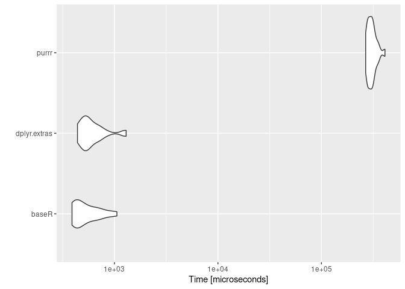

<!-- README.md is generated from README.Rmd. Please edit that file -->

# dplyr.extras

<!-- badges: start -->
<!-- badges: end -->

The goal of dplyr.extras is to …

## Installation

You can install the development version of dplyr.extras from
[GitHub](https://github.com/) with:

``` r
# install.packages("devtools")
devtools::install_github("vituri/dplyr.extras")
```

## Motivation

`dplyr.extras` intends to:

- make it easy to apply functions conditionally in the middle of a pipe;
- modify and subset vectors in a “pipeable” manner, like we do with
  dataframes using `dplyr::filter` and `dplyr::mutate`;
- generalize functions that “glue” dataframes to an existing one, like
  `dplyr::add_count`.

## Examples

For the examples, consider this dataframe:

``` r
library(dplyr.extras)
#> Carregando pacotes exigidos: dplyr
#> 
#> Attaching package: 'dplyr'
#> The following objects are masked from 'package:stats':
#> 
#>     filter, lag
#> The following objects are masked from 'package:base':
#> 
#>     intersect, setdiff, setequal, union
#> Carregando pacotes exigidos: magrittr
set.seed(1)
n = 10
df = 
  dplyr::tibble(
    a = runif(n = n)
    , b = c('a', rep('b', 2), rep('c', 3), rep('d', 4))
    )

df
#> # A tibble: 10 × 2
#>         a b    
#>     <dbl> <chr>
#>  1 0.266  a    
#>  2 0.372  b    
#>  3 0.573  b    
#>  4 0.908  c    
#>  5 0.202  c    
#>  6 0.898  c    
#>  7 0.945  d    
#>  8 0.661  d    
#>  9 0.629  d    
#> 10 0.0618 d
```

### Conditionally apply a function in the middle of a pipe

Suppose we are in a shiny app and there is a filter in a widget; it
displays the letters in `df$b` and also the string `all`. If the
selected string is `all`, we don’t want to filter our `df`. This can be
done in a pipe as this:

``` r
selected_string = 'all' # from the input$selected_string

df %>% 
  {
    if (selected_string == 'all') {
      (.)
    } else {
      (.) %>% filter(b %in% selected_string)
    }
  } # %>% 
#> # A tibble: 10 × 2
#>         a b    
#>     <dbl> <chr>
#>  1 0.266  a    
#>  2 0.372  b    
#>  3 0.573  b    
#>  4 0.908  c    
#>  5 0.202  c    
#>  6 0.898  c    
#>  7 0.945  d    
#>  8 0.661  d    
#>  9 0.629  d    
#> 10 0.0618 d
#  ... the rest of the pipe
```

With `dplyr.extras`, this can be a bit shorter:

``` r
df %>% 
  map_if_true(condition = selected_string != 'all', .f = . %>% filter(b %in% selected_string)) # %>% 
#> # A tibble: 10 × 2
#>         a b    
#>     <dbl> <chr>
#>  1 0.266  a    
#>  2 0.372  b    
#>  3 0.573  b    
#>  4 0.908  c    
#>  5 0.202  c    
#>  6 0.898  c    
#>  7 0.945  d    
#>  8 0.661  d    
#>  9 0.629  d    
#> 10 0.0618 d
  # ...
```

There is also the variant

``` r
df %>% 
  map_if_condition(condition, .f_if_true, .f_if_false)
```

where we can apply two different functions, depending on the truthy of
`condition`.

As another example: using `dbplyr` to query a table in a database, we
can create a function like this

``` r
get_data_from_my_table = function(con, var1 = NULL, var2 = NULL, var3 = NULL) {
  tbl(con, 'table_name') %>% 
    map_if_true(!is.null(v1), . %>% filter(Column1 %in% var1)) %>% 
    map_if_true(!is.null(v2), . %>% filter(Column2 %in% var2)) %>% 
    map_if_true(!is.null(v3), . %>% filter(Column3 %in% var3)) %>% 
    # ...
    collect()
}
```

to query data with the filters we give. If `var1` is `NULL`, for
example, we won’t filter the values in Column1 of our table, and so on.

### `add_count` but without count

Sometimes, given a dataframe `df` like above we would like to add
columns that somehow aggregate the dataframe. The function
`dplyr::add_cout` does this with count:

``` r
df %>% add_count(b, name = 'count')
#> # A tibble: 10 × 3
#>         a b     count
#>     <dbl> <chr> <int>
#>  1 0.266  a         1
#>  2 0.372  b         2
#>  3 0.573  b         2
#>  4 0.908  c         3
#>  5 0.202  c         3
#>  6 0.898  c         3
#>  7 0.945  d         4
#>  8 0.661  d         4
#>  9 0.629  d         4
#> 10 0.0618 d         4
```

What if we wanted to summarise the max of `a` for each `b` instead of
counting?

``` r
df %>% 
  left_join(
    df %>% summarise(max = max(a), .by = b)
  )
#> Joining with `by = join_by(b)`
#> # A tibble: 10 × 3
#>         a b       max
#>     <dbl> <chr> <dbl>
#>  1 0.266  a     0.266
#>  2 0.372  b     0.573
#>  3 0.573  b     0.573
#>  4 0.908  c     0.908
#>  5 0.202  c     0.908
#>  6 0.898  c     0.908
#>  7 0.945  d     0.945
#>  8 0.661  d     0.945
#>  9 0.629  d     0.945
#> 10 0.0618 d     0.945
```

With `dplyr.extras` we can save some lines:

``` r
df %>% 
  map_then_left_join(.f = \(df) df %>% summarise(max = max(a), .by = b))
#> # A tibble: 10 × 3
#>         a b       max
#>     <dbl> <chr> <dbl>
#>  1 0.266  a     0.266
#>  2 0.372  b     0.573
#>  3 0.573  b     0.573
#>  4 0.908  c     0.908
#>  5 0.202  c     0.908
#>  6 0.898  c     0.908
#>  7 0.945  d     0.945
#>  8 0.661  d     0.945
#>  9 0.629  d     0.945
#> 10 0.0618 d     0.945
```

### Filtering and modifying vectors

Suppose we want to do the following: given an integer vector `x`

``` r
x = 1:50
x
#>  [1]  1  2  3  4  5  6  7  8  9 10 11 12 13 14 15 16 17 18 19 20 21 22 23 24 25
#> [26] 26 27 28 29 30 31 32 33 34 35 36 37 38 39 40 41 42 43 44 45 46 47 48 49 50
```

we want to:

- keep only the even numbers of x;
- add 1 to all numbers of x;
- multiply by -1 the numbers less than 25;
- sum the result

``` r
# dplyr.extras approach can be "piped"
x %>% 
  vec_filter(\(x) x %% 2 == 0) %>% # keep the even
  vec_mutate(\(x) x+1) %>% # sum 1
  vec_mutate(\(x) -x, \(x) x < 25) %>% # multiply by -1 only those that satisfy x < 25 
  sum()
#> [1] 389
```

Compare it with the base R approach:

``` r
y = x[x %% 2 == 0]
z = y + 1
w = z
id = w < 25
w[id] = - w[id]
sum(w)
#> [1] 389
```

### Performance of vec_mutate when compared to purrr

``` r
x = 1:1e5

# get the sum of all odd numbers in x
x %>% vec_filter(\(x) x %% 2 == 0) %>% sum()
#> [1] 2500050000

# get all numbers where the square of it is less than 10000
x %>% vec_filter(\(x) x^2 < 10000)
#>  [1]  1  2  3  4  5  6  7  8  9 10 11 12 13 14 15 16 17 18 19 20 21 22 23 24 25
#> [26] 26 27 28 29 30 31 32 33 34 35 36 37 38 39 40 41 42 43 44 45 46 47 48 49 50
#> [51] 51 52 53 54 55 56 57 58 59 60 61 62 63 64 65 66 67 68 69 70 71 72 73 74 75
#> [76] 76 77 78 79 80 81 82 83 84 85 86 87 88 89 90 91 92 93 94 95 96 97 98 99

# take values from column b when a is NA
tibble::tibble(
  a = 1:10 %>% vec_mutate(NA, \(x) x %% 2 == 0)
  ,b = -(1:10)
) %>% 
  dplyr::mutate(
    if_a_is_na_then_b = a %>% vec_mutate(b, is.na)
  )
#> # A tibble: 10 × 3
#>        a     b if_a_is_na_then_b
#>    <int> <int>             <int>
#>  1     1    -1                 1
#>  2    NA    -2                -2
#>  3     3    -3                 3
#>  4    NA    -4                -4
#>  5     5    -5                 5
#>  6    NA    -6                -6
#>  7     7    -7                 7
#>  8    NA    -8                -8
#>  9     9    -9                 9
#> 10    NA   -10               -10
```

Compared to `purrr::keep` and `purrr::modify`, `dplyr.extras` is faster
because it only accepts vectors and vectorized functions.

``` r
x = 1:1e5

mbm = microbenchmark::microbenchmark(
  baseR = {
    x[x^2 <= 5000]
  }
  ,dplyr.extras = {
    x %>% vec_filter(~ .x^2 <= 5000)
  }
  ,purrr = {
    x %>% purrr::keep(~ .x^2 <= 5000)
  }

  ,times = 25L
)

mbm
#> Unit: microseconds
#>          expr        min         lq        mean     median         uq
#>         baseR    388.460    413.266    509.0370    470.439    650.385
#>  dplyr.extras    434.625    505.540    577.1983    536.025    590.488
#>         purrr 264578.760 278283.763 282120.7121 279741.249 285190.041
#>         max neval
#>     702.293    25
#>     824.900    25
#>  333712.368    25
```

``` r
ggplot2::autoplot(mbm)
```



``` r
x = 1:1e5

mbm2 = microbenchmark::microbenchmark(
  baseR = {
    ids = x <= 10000
    x[ids] = x[ids] + 2
    x
  }
  ,dplyr.extras = {
    x %>% vec_mutate(~ .x + 2, ~ .x <= 10000)
  }
  ,purrr = {
    x %>% purrr::modify_if(.f = ~ .x + 2L, .p = ~.x <= 10000)
  }

  ,times = 25L
)

mbm2
#> Unit: microseconds
#>          expr        min         lq        mean     median         uq
#>         baseR    350.278    389.774    530.7576    441.364    537.440
#>  dplyr.extras    617.165    759.677   1057.1402    802.275   1306.195
#>         purrr 262022.492 274642.117 279751.7688 277307.596 281017.938
#>         max neval
#>    1201.706    25
#>    2501.607    25
#>  361533.801    25
```

``` r
ggplot2::autoplot(mbm2)
```


